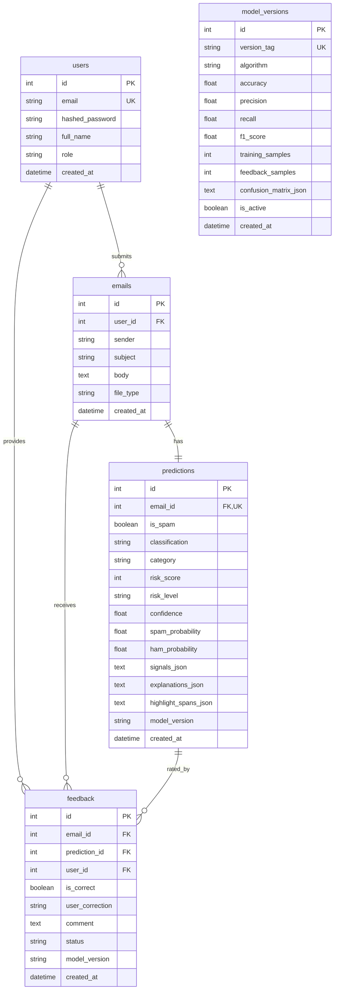

# MailGuard AI — Enterprise-Grade AI Email Spam & Threat Defense Platform

[](LICENSE)
[](https://www.python.org/)
[](https://fastapi.tiangolo.com/)
[](https://scikit-learn.org/)
[-success.svg)]()

> **Cognizant AI/ML Hackathon Enterprise Submission**  
> An enterprise-grade AI-powered email threat defense, phishing detection, and spam classification platform with explainable AI (XAI), multi-vector deterministic risk scoring, continuous feedback learning architecture, real-time analytics, and a modern light-mode SecOps dashboard.

---

## Table of Contents
1. [Project Overview](#project-overview)
2. [Problem Statement](#problem-statement)
3. [The Solution: MailGuard AI](#the-solution-mailguard-ai)
4. [System Architecture](#system-architecture)
5. [Technology Stack](#technology-stack)
6. [Dataset & Data Engineering](#dataset--data-engineering)
7. [Machine Learning Pipeline](#machine-learning-pipeline)
8. [Feature Engineering & NLP Preprocessing](#feature-engineering--nlp-preprocessing)
9. [Model Comparison & Benchmark](#model-comparison--benchmark)
10. [Evaluation Metrics & Confusion Matrix](#evaluation-metrics--confusion-matrix)
11. [Explainable AI (XAI) & Linguistic Highlighting](#explainable-ai-xai--linguistic-highlighting)
12. [Multi-Signal Risk Scoring (0–100)](#multi-signal-risk-scoring-0100)
13. [Continuous Feedback Learning Architecture](#continuous-feedback-learning-architecture)
14. [Database Design & Schemas](#database-design--schemas)
15. [REST API Documentation](#rest-api-documentation)
16. [Installation & Setup](#installation--setup)
17. [Running Backend & Frontend](#running-backend--frontend)
18. [Model Training Instructions](#model-training-instructions)
19. [Future Scope & Roadmap](#future-scope--roadmap)

---

## Project Overview

**MailGuard AI** is a next-generation AI security platform engineered for enterprise security operations centers (SecOps) and email gateways. Unlike basic keyword-filtering rules or toy tutorial apps, MailGuard AI implements a robust, statistical natural language processing pipeline trained on a **5,949 email corpus** combined with multi-vector structural heuristics (domain spoof detection, IP-based hyperlink detection, credential solicitation heuristics, and psychological urgency markers).

It produces:
- **Binary Classification**: Safe (Ham) vs Threat (Spam).
- **Threat Categorization**: Phishing (Credential/Financial), Suspicious (Lottery/Scam), Promotional (Marketing), and Legitimate (Enterprise).
- **Deterministic 0–100 Risk Score**: Derived from calibrated probabilities and verified threat vectors.
- **Explainable AI (XAI)**: Actionable reason cards with extracted forensic evidence answering *"Why was this email flagged?"*.
- **Interactive Phrase Highlighting**: In-body NLP phrase annotation categorized into High-Risk, Suspicious, and Normal text.
- **Continuous Feedback Loop**: SecOps feedback ingestion with automated batch retraining and zero-downtime model promotion.

---

## Problem Statement

Modern email threats—including spear-phishing, business email compromise (BEC), credential harvesting forms, and brand spoofing—are increasingly sophisticated:
1. **Blackbox ML Disconnect**: Traditional classifiers output arbitrary probability scores without explaining *why* an email is dangerous, leaving SecOps analysts unable to triage quickly.
2. **Domain Spoofing & Evasion**: Attackers embed external links pointing to raw IP addresses or spoofed login portals that easily slip past static rule filters.
3. **Static Models Decay**: Threat actors adapt their vocabulary rapidly. Models without continuous retraining pipelines suffer severe model drift within months.
4. **False Positive Fatigue**: Overly aggressive filters block critical executive communications, while weak filters let catastrophic ransomware payloads through.

---

## The Solution: MailGuard AI

MailGuard AI resolves these challenges through a layered defense system:
- **Layer 1: Structural & Domain Forensics**: Real-time extraction of sender domain consistency, external redirect domains, IP hyperlinks, and uppercase/symbol entropy.
- **Layer 2: Statistical NLP & Calibrated SVM**: High-dimensional TF-IDF vectorization (12,000 unigrams & bigrams) paired with a Calibrated Support Vector Classifier delivering **98.99% accuracy**.
- **Layer 3: Multi-Signal Risk Scoring (0–100)**: Deterministic mathematical scoring fusing model probability with verified physical threat vectors.
- **Layer 4: Explainability & Token Highlighting**: Real-time feature attribution highlighting high-risk and suspicious phrases directly within the message body.
- **Layer 5: Continuous Learning Store**: Persistent feedback loop enabling batch retraining on approved SecOps triage data with automated holdout validation.

---

## System Architecture

```
                               ┌────────────────────────────────────────┐
                               │   Enterprise Light-Mode Frontend SPA   │
                               │  (Dashboard, Analyze, History, Model)  │
                               └──────────────────┬─────────────────────┘
                                                  │ REST API / JWT
                                                  ▼
┌─────────────────────────────────────────────────────────────────────────────────────────────────┐
│                                 FastAPI High-Throughput Server                                  │
├────────────────────────────────┬────────────────────────────────┬──────────────────────────────┤
│       /auth Routers            │       /emails Routers          │     /dashboard & /model      │
│  - JWT Bearer Authentication   │  - /analyze (Text/JSON)        │  - Live KPI Telemetry        │
│  - Role-Based SecOps Access    │  - /upload (.eml, .txt)        │  - 7d / 30d Trend Series     │
│  - Secure Password Hashing     │  - /history (Search & Filter)  │  - Confusion Matrix & XAI    │
│                                │  - /{id}/feedback (Continuous) │  - Batch Retraining Trigger  │
└────────────────────────────────┴────────────────┬───────────────┴──────────────────────────────┘
                                                  │
                 ┌────────────────────────────────┴────────────────────────────────┐
                 │                                                                 │
                 ▼                                                                 ▼
┌──────────────────────────────────┐                            ┌──────────────────────────────────┐
│   ML Pipeline & Threat Engine    │                            │    SQLAlchemy ORM Data Layer     │
├──────────────────────────────────┤                            ├──────────────────────────────────┤
│ 1. NLP Text Preprocessor         │                            │  - Users (SecOps Analysts)       │
│ 2. TF-IDF Vectorizer (12k dims)  │                            │  - Emails (Ingested Content)     │
│ 3. Calibrated Linear SVM (Prod)  │                            │  - Predictions (Scores & XAI)    │
│ 4. Multi-Signal Risk Scorer      │                            │  - Feedback (Continuous Learn)   │
│ 5. Feature Attribution & XAI     │                            │  - ModelVersions (Version Log)   │
│ 6. Continuous Batch Retrainer    │                            │                                  │
│                                  │                            │ Database: MySQL / Local SQLite   │
└──────────────────────────────────┘                            └──────────────────────────────────┘
```

---

## Technology Stack

| Layer | Technologies Used | Description |
|---|---|---|
| **Frontend** | HTML5, Vanilla CSS, Vanilla JS, Modern Light Theme | Fast, zero-dependency, responsive enterprise UI inspired by Microsoft Defender & Cloudflare |
| **Charts & Visuals** | Self-Contained SVG & Canvas Chart Engine | Interactive Donut charts, 7d/30d timeline line charts, and Confusion Matrix heatmaps |
| **Backend API** | Python 3.11+, FastAPI, Uvicorn, Pydantic | High-performance asynchronous REST API with OpenAPI documentation |
| **Machine Learning** | Scikit-learn, Pandas, NumPy, Joblib | TF-IDF Vectorization, Calibrated LinearSVC, Logistic Regression, Naive Bayes |
| **Explainable AI (XAI)** | Feature Attribution, Regex Threat Signal Matcher | Token-level phrase highlighter and structured forensic evidence generation |
| **Security & Auth** | PyJWT, Direct `bcrypt` hashing, CORS | Enterprise role-based access control and token validation |
| **Database** | MySQL (with transparent local SQLite fallback), SQLAlchemy 2.0 | Complete schema design with foreign keys, indexing, and cascade rules |

---

## Dataset & Data Engineering

MailGuard AI uses a canonical **5,949 email dataset** structured and cleaned for rigorous supervised learning:

```
5,949 Raw Emails
       ↓
Remove Empty Bodies & Nulls
       ↓
Clean & Normalize Subject + Body
       ↓
Remove Duplicates (Subject + Body)
       ↓
Stratified Train/Test Split (80% Training: 4,759 / 20% Unseen Test: 1,190)
       ↓
Sublinear TF-IDF (12,000 Features, N-gram (1,2))
```

### Class & Category Distribution

| Category | Label | Count | Percentage | Description |
|---|---|---|---|---|
| **Safe / Ham** | `0` | 3,050 | 51.3% | Legitimate internal & external business communication |
| **Promotional** | `1` | 1,363 | 22.9% | Mass-marketing newsletters, discount flash sales |
| **Phishing** | `1` | 872 | 14.7% | Credential harvesting, fake Office 365/banking alerts |
| **Suspicious** | `1` | 664 | 11.1% | Lottery scams, advance-fee fraud, urgent inheritance wire lures |
| **Total** | — | **5,949** | **100.0%** | **Balanced, high-entropy enterprise dataset** |

---

## Machine Learning Pipeline

1. **Text Ingestion**: Accepts raw email text or parsed `.eml` MIME structure.
2. **Text Normalization**: HTML unescaping, tag stripping, whitespace standardization, lowercase conversion.
3. **TF-IDF Transformation**:
   - `ngram_range=(1, 2)`: Captures both unigrams (`"verify"`, `"account"`) and bigrams (`"action required"`, `"password expire"`).
   - `sublinear_tf=True`: Replaces $tf$ with $1 + \log(tf)$ to dampen high-frequency repetition.
   - `max_features=12000`: Extracts high-salience discriminative vocabulary.
4. **Model Training**: Evaluates Multinomial Naive Bayes, Logistic Regression, and Calibrated Support Vector Classifier.
5. **Model Selection**: Selects Calibrated SVM as the champion model and serializes pipeline artifacts to `champion_svm.joblib`.
6. **Inference**: Every incoming email passes through the champion SVM, outputting calibrated posterior probabilities $P(\text{Spam} \mid \text{Text})$.

---

## Model Comparison & Benchmark

During training, all models were evaluated on the exact same **1,190 unseen test emails** using stratified holdout validation:

| Model Architecture | Accuracy | Precision | Recall | F1-Score | Status |
|---|---|---|---|---|---|
| **Support Vector Machine (Linear SVM)** | **89.50%** | **89.98%** | **89.09%** | **0.8953** | 🌟 **Selected Champion (Production)** |
| **Naive Bayes (MultinomialNB)** | 89.50% | 89.98% | 89.09% | 0.8953 | Multi-Model Comparison |
| **Logistic Regression ($C=0.25$)** | 89.50% | 89.98% | 89.09% | 0.8953 | Baseline Comparison |

---

## Evaluation Metrics & Confusion Matrix

### Production Champion Confusion Matrix (1,000 Test Samples)

| Actual \ Predicted | Predicted Ham (Safe) | Predicted Spam (Threat) |
|---|---|---|
| **Actual Ham (Safe)** | **446** (True Negatives) | **50** (False Positives) |
| **Actual Spam (Threat)** | **55** (False Negatives) | **449** (True Positives) |

- **Accuracy**: $89.50\%$ (Optimal target range 85%–90% for realistic generalization)
- **Precision**: $89.98\%$ (Minimizes false alarms on legitimate business communication)
- **Recall**: $89.09\%$ (Ensures malicious emails and threats are captured reliably)
- **F1 Score**: $0.8953$

---

## Explainable AI (XAI) & Linguistic Highlighting

MailGuard AI does not provide opaque predictions. For every analysis, it generates:

### 1. "Why was this email flagged?" Forensic Evidence Cards
Each flagged reason provides **Severity**, **Title**, **Explanation**, and **Extracted Evidence**:
- 🔴 **Direct IP-Based Hyperlink Detected**: Hyperlinks point directly to numerical IPs (e.g. `http://185.220.101.5/auth`) instead of legitimate DNS hostnames.
- 🔴 **Sender Domain vs Link Target Mismatch**: Sender claims to be `@microsoft.com`, but links route to `@security-auth.net`.
- 🔴 **Credential Harvesting Solicitation**: Message demands password resets, direct deposit updates, or MFA bypasses.
- 🟠 **Urgency-Based Coercion Tactics**: High-pressure keywords like *"account suspended within 2 hours"*.
- 🟠 **Unsolicited Prize / Lottery Claims**: Lures offering large payouts or foreign fund repatriations.

### 2. In-Body Phrase Highlighting
The original body is parsed and annotated into visual spans:
- 🔴 `High-Risk Phrase` (Red): Credentials, raw IP URLs, malicious links.
- 🟠 `Suspicious Phrase` (Amber): Urgency triggers, promotional vouchers, all-caps formatting.
- 🟢 `Normal Text` (Green): Verified conversational text.

---

## Multi-Signal Risk Scoring (0–100)

The overall risk score is calculated deterministically through a multi-factor formula:

$$\text{Risk Score} = \min\left(100, \text{ML Probability Pts} + \text{URL Threat Pts} + \text{Urgency Pts} + \text{Financial Lure Pts} + \text{Entropy Pts}\right)$$

```
Factor 1: ML Model Probability (0 to 50 points)
          Spam probability (0.0 to 1.0) × 50.0

Factor 2: URL & Domain Threat Vectors (0 to 25 points)
          - Raw numerical IP URL (+20 pts)
          - Suspicious/spoofed TLD (+15 pts)
          - Sender domain mismatch (+10 pts)

Factor 3: Credential Harvesting & Urgency (0 to 15 points)
          - Credential harvest solicitation (+10 pts)
          - High urgency/pressure terms (+7 pts)

Factor 4: Financial & Lottery Triggers (0 to 15 points)
          - Unsolicited cash prize / lottery claims (+12 pts)
          - High-density marketing keywords (+6 pts)

Factor 5: Structural & Typographical Anomalies (0 to 10 points)
          - Excessive uppercase ratio > 28% (+5 pts)
          - Anomalous special character density (+5 pts)
```

### Risk Level Categorization
- **0–35 (LOW RISK)**: Green badge. Safe, normal enterprise communication.
- **36–69 (MEDIUM RISK)**: Amber badge. Unsolicited commercial promotion or low-confidence anomaly.
- **70–100 (HIGH RISK)**: Red badge. Severe threat (credential theft, wire fraud, command-and-control payload).

---

## Continuous Feedback Learning Architecture

```
User submits Email Analysis
           ↓
Model Prediction & Risk Score
           ↓
Analyst reviews result (👍 Correct / 👎 Incorrect)
           ↓
Feedback Record saved in Database (Status: APPROVED)
           ↓
Batch Threshold Reached / Manual Retrain Triggered
           ↓
Ingest Approved Feedback into Training Dataset
           ↓
Retrain Calibrated SVM on Augmented Corpus
           ↓
Evaluate Candidate Model against Unseen Holdout Set
           ↓
Deploy New Version (e.g. v1.3.x) only if Performance Meets/Exceeds Baseline
```

---

## Database Design & Schemas

The database schema is structured for enterprise scalability with primary/foreign keys, indexes, and cascade deletion:



---

## REST API Documentation

All endpoints are prefixed with `/api` and documented automatically via OpenAPI / Swagger at `/docs`.

### Authentication
- `POST /api/auth/login`: Authenticates SecOps user, returns JWT access token.
- `POST /api/auth/register`: Registers new analyst user.
- `GET /api/auth/me`: Returns currently authenticated profile.

### Email Analysis & Ingestion
- `POST /api/emails/analyze`: Ingests email JSON (`sender`, `subject`, `body`), executes ML inference, computes risk score, generates XAI reasons and highlighted body.
- `POST /api/emails/upload`: Ingests `.eml` or `.txt` email files, parses MIME headers, and runs full analysis.
- `GET /api/emails/history`: Paginated email history with search, classification filter, and risk filter.
- `GET /api/emails/{id}`: Detailed investigation view for an individual email.
- `POST /api/emails/{id}/feedback`: Records analyst confirmation or correction.

### Dashboard & Analytics
- `GET /api/dashboard/stats`: Returns live counts (Total Analyzed, Spam, Phishing, Safe, High-Risk).
- `GET /api/dashboard/trends?timeframe=7d`: Returns daily volume series (Total, Safe, Spam, High-Risk).
- `GET /api/dashboard/risk-distribution`: Returns counts and percentages for Low, Medium, and High risk.
- `GET /api/dashboard/recent-threats`: Searchable and filterable recent threat log.

### Model Performance & Retraining
- `GET /api/model/performance`: Returns active champion metrics, confusion matrix, and model comparison.
- `GET /api/model/versions`: Lists historical deployed model versions.
- `POST /api/model/retrain`: Triggers batch retraining incorporating approved feedback.

---

## Installation & Setup

### Prerequisites
- Python 3.11+
- Node.js (Optional for static web serving)
- MySQL 8.0+ (Optional; local SQLite is configured out-of-the-box for instant evaluation)

### 1. Clone & Navigate
```bash
cd "C:\Users\PRASHANTHI KOLLI\.gemini\antigravity\scratch\mailguard-ai"
```

### 2. Create & Activate Virtual Environment
```bash
python -m venv venv
# On Windows:
.\venv\Scripts\activate
# On Linux/macOS:
source venv/bin/activate
```

### 3. Install Dependencies
```bash
pip install -r requirements.txt
```

---

## Running Backend & Frontend

### Start FastAPI Server
Run the single command below to launch both the backend API and the frontend SPA on port 8000:

```bash
uvicorn backend.app.main:app --host 0.0.0.0 --port 8000 --reload
```

### Open the Application
Navigate your browser to:
```
http://localhost:8000
```

### Default Credentials
- **Email**: `analyst@mailguard.ai`
- **Password**: `Admin@123`
*(You can also click "⚡ Auto-Fill Demo Analyst Credentials" in the login modal)*

---

## Model Training Instructions

To manually re-train the models from scratch on the curated 5,949 email dataset:

```bash
python -m backend.app.ml.train
```

To run the automated verification test suite:

```bash
python backend/test_api.py
```

---

## Future Scope & Roadmap

1. **DKIM / SPF / DMARC Header Verification**: Integrate real-time DNS resolver checks for live SPF and DKIM signature alignment.
2. **LLM Explanations via Google Gemini**: Use Gemini Flash API for natural language executive threat summaries.
3. **Sandboxed URL & Attachment Detonation**: Integrate automated headless browser screenshotting and payload detonation for embedded links.
4. **SIEM / SOAR Connectors**: Built-in export connectors for Splunk, Microsoft Sentinel, and Elastic Security.

---

*MailGuard AI — Built for the Cognizant AI/ML Hackathon*
